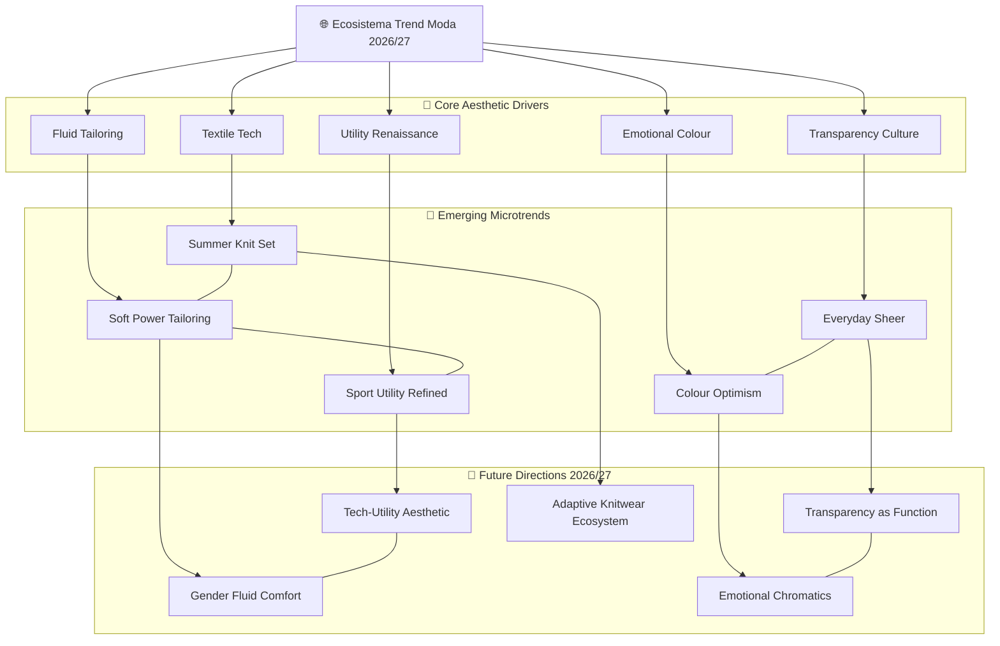

```mermaid
graph TB
    A["🌐 Ecosistema Trend Moda 2026/27"]

    %% LIVELLO 1 - DRIVER CENTRALI
    subgraph CORE ["💎 Core Aesthetic Drivers"]
        B1["Fluid Tailoring"]
        B2["Transparency Culture"]
        B3["Utility Renaissance"]
        B4["Emotional Colour"]
        B5["Textile Tech"]
    end

    %% LIVELLO 2 - MICROTREND EMERGENTI
    subgraph MICRO ["🌈 Emerging Microtrends"]
        C1["Soft Power Tailoring"]
        C2["Everyday Sheer"]
        C3["Sport Utility Refined"]
        C4["Summer Knit Set"]
        C5["Colour Optimism"]
    end

    %% LIVELLO 3 - DIREZIONI FUTURE
    subgraph FUTURE ["🚀 Future Directions 2026/27"]
        D1["Gender Fluid Comfort"]
        D2["Transparency as Function"]
        D3["Tech-Utility Aesthetic"]
        D4["Adaptive Knitwear Ecosystem"]
        D5["Emotional Chromatics"]
    end

    %% CONNESSIONI RADIALI
    A --> B1
    A --> B2
    A --> B3
    A --> B4
    A --> B5

    B1 --> C1
    B2 --> C2
    B3 --> C3
    B4 --> C5
    B5 --> C4

    C1 --> D1
    C2 --> D2
    C3 --> D3
    C4 --> D4
    C5 --> D5

    %% CROSS-RELATIONS (INTERCONNESSIONI TRA TREND)
    C1 --- C3
    C2 --- C5
    C4 --- C1
    D2 --- D5
    D3 --- D1
```
